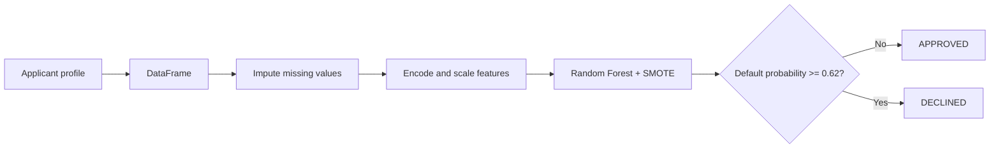
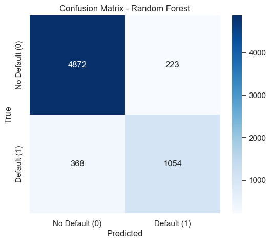
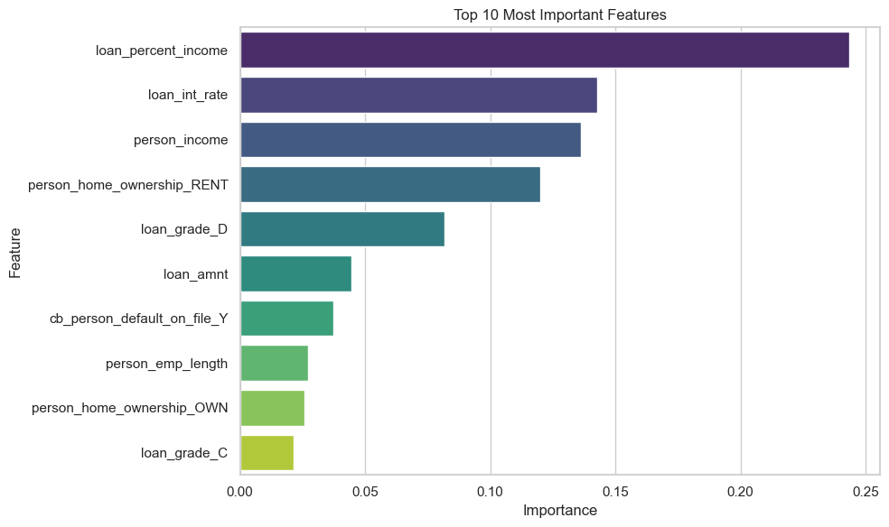
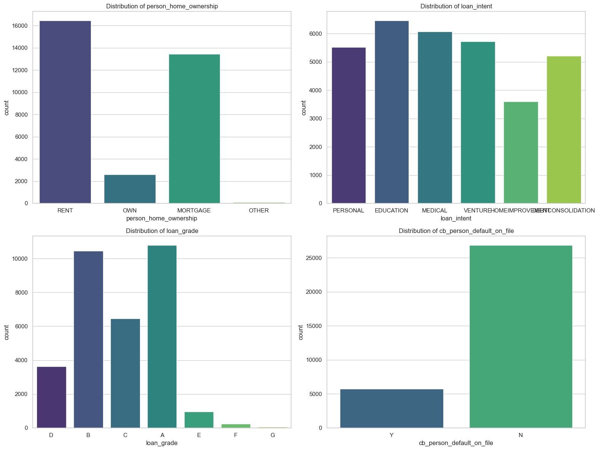

<div align="center">

<h1>Credit Risk Assessment</h1>

<a href="#run-it-in-60-seconds">
  
</a>


<p><em>A production-style machine learning workflow that turns applicant and loan data into a transparent default-risk decision.</em></p>

<p>
  <a href="#run-it-in-60-seconds"><strong>Run it in 60 seconds</strong></a> ·
  <a href="#results-at-a-glance"><strong>See the results</strong></a> ·
  <a href="#how-a-decision-is-made"><strong>Follow the decision path</strong></a>
</p>

</div>

---

## The short version

This project trains, evaluates, and deploys a credit-risk model that estimates the probability of loan default. A Streamlit interface lets a user enter an applicant profile and receive an approval or decline recommendation using the same preprocessing pipeline and threshold selected during model development.

| | Project signal |
|---|---|
| **32,581** | loan records analyzed |
| **21.8%** | default rate in the source data |
| **0.92** | ROC-AUC from the final model |
| **74%** | default recall, up from 57% for the baseline |

> This is a decision-support project, not a substitute for regulated lending review. Model output should be audited for fairness, drift, and local compliance before real-world use.

## Run it in 60 seconds

```bash
git clone https://github.com/YOUR-USERNAME/credit-risk-assessment.git
cd credit-risk-assessment
python -m venv venv

# Windows
venv\Scripts\activate
# macOS / Linux
source venv/bin/activate

pip install -r requirements.txt
streamlit run credit_risk_assessment.py
```

Open `http://localhost:8501`, enter an applicant profile, and select **Predict**. The saved artifact `credit_risk_production_model.pkl` is included, so the dashboard can score applicants immediately after installation.

<details>
<summary><strong>Prefer the analysis notebook?</strong></summary>

```bash
jupyter notebook CREDIT_RISK_ASSESSMENT.ipynb
```

The notebook walks through the data, preprocessing, model comparison, threshold selection, and evaluation plots.
</details>

## How a decision is made



The model is intentionally evaluated around the cost of missed defaults, rather than accuracy alone. The final threshold is `0.62`: applicants below it are approved by the application logic, while applicants at or above it are declined.

## Results at a glance

Evaluation used a held-out test set of 6,517 loans, including 1,422 defaults.

| Model | Accuracy | Precision | Default recall | F1 | ROC-AUC |
|---|---:|---:|---:|---:|---:|
| Decision Tree baseline | 0.9033 | 0.9818 | 0.5675 | 0.7193 | 0.8736 |
| **Random Forest + SMOTE** | **0.9093** | **0.8254** | **0.7412** | **0.7810** | **0.9202** |

<details>
<summary><strong>What changed from baseline?</strong></summary>

The production model raises default recall from 56.75% to 74.12% and ROC-AUC from 0.8736 to 0.9202. Precision is lower than the baseline, which reflects the deliberate choice to catch more risky loans instead of optimizing for a single headline accuracy number.
</details>

### Model configuration

The selected Random Forest uses `n_estimators=100`, `max_depth=10`, `min_samples_split=10`, and `min_samples_leaf=4`. The workflow also uses median imputation, one-hot encoding, scaling, class weighting, and SMOTE within the modeling process.



## Explore the risk signals

The strongest model drivers in this analysis are:

1. `loan_percent_income`
2. `loan_int_rate`
3. `person_income`
4. `person_home_ownership = RENT`
5. `loan_grade = D`



<details>
<summary><strong>What data goes into the model?</strong></summary>

| Applicant | Loan | Credit history |
|---|---|---|
| `person_age` | `loan_intent` | `cb_person_default_on_file` |
| `person_income` | `loan_grade` | `cb_person_cred_hist_length` |
| `person_home_ownership` | `loan_amnt` | |
| `person_emp_length` | `loan_int_rate` | |
| | `loan_percent_income` | |

Target: `loan_status`, where `1` means default and `0` means no default. Source: [Kaggle Credit Risk Dataset](https://www.kaggle.com/datasets/laotse/credit-risk-dataset).
</details>



## Try the dashboard

The Streamlit app in [credit_risk_assessment.py](credit_risk_assessment.py) returns three things for each applicant:

- a threshold-based recommendation: **Approved** or **Declined**
- the estimated probability of default
- a consistent result from the persisted production pipeline

| Scenario | Probability of default | Result |
|---|---:|---|
| 35 years old, 75,000 income, mortgage, grade B, 15,000 loan | 16.87% | **Approved** |
| 23 years old, 15,000 income, renting, grade E, 9,000 loan, prior default | 97.27% | **Declined** |

## Repository map

```text
credit-risk-assessment/
├── data/credit_risk_dataset.csv          # Source data
├── images/                                # Evaluation and distribution plots
├── CREDIT_RISK_ASSESSMENT.ipynb          # End-to-end analysis
├── credit_risk_assessment.py             # Streamlit interface
├── credit_risk_production_model.pkl      # Persisted pipeline + threshold
├── requirements.txt                      # Reproducible dependencies
└── README.md
```

## Stack and reproducibility

| Layer | Tools |
|---|---|
| Data and plots | pandas, NumPy, Matplotlib, Seaborn |
| Modeling | scikit-learn, imbalanced-learn |
| Persistence | joblib |
| Interface | Streamlit |

Use Python 3.10–3.13. `scikit-learn==1.6.1` and `imbalanced-learn==0.13.0` are pinned because the persisted model depends on those versions.

## Next upgrades

- Add SHAP explanation cards to each recommendation.
- Calculate `loan_percent_income` from income and loan amount in the app.
- Add calibration, fairness, and drift monitoring.
- Compare the current model with XGBoost or LightGBM.
- Deploy the dashboard to Streamlit Community Cloud.

## License

This project is licensed under the MIT License. See [LICENSE](LICENSE) for details.

<div align="center"><sub>Built for practical risk assessment and transparent lending decisions.</sub></div>
